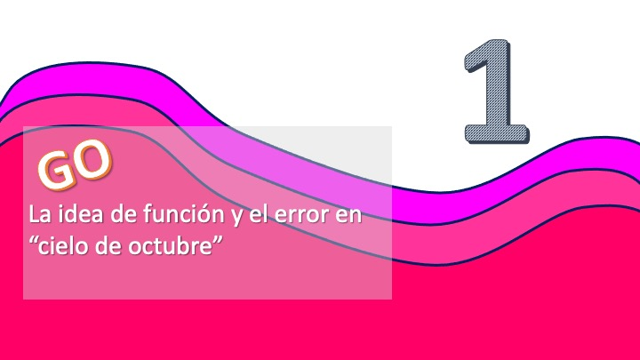
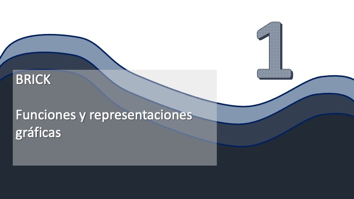
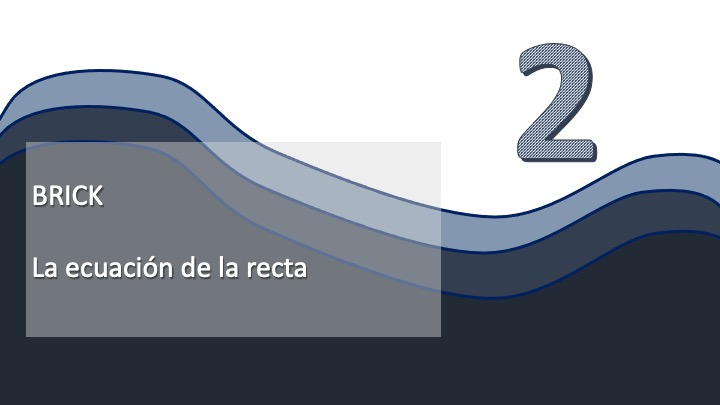

```{css, echo=FALSE}
p {
  font-size:30px;
}

```


# SESIÓN 1: Funciones (aspectos generales) y Funciones Lineales


Si ves este vídeo introductorio (haz click en la carátula), te explicamos algo más "de qué va" este Grupo 0


[](https://youtu.be/p07qNDH40Eg)


> **_Sobre el Grupo 0:_**  Recuerda: es importante que utilices las tutorías escribiendo, a través del Campus Virtual, a tu tutor/a. No mantengas las dudas durante 15 días. Recuerda, además, que este año el Grupo 0 tiene evaluación. En las sesiones 2,3,4 y 5 se te evaluará sobre lo visto en la anterior sesión.


Puedes ver, ahora, el primer vídeo de Matemáticas GO que, de una manera relajada, te cuenta ideas básicas de todo el capítulo de funciones. Le encontramos hasta un error a la película "Cielo de Octubre".


[](https://youtu.be/S0GHXo9IKVE)


Ahora, puedes ver el vídeo "Matemáticas Brick # 1" donde se repasan conceptos sobre funciones de variable real que ya has visto en bachillerato. Haz link en el siguiente enlace:


[](https://youtu.be/pnNLs4QWO3g)


::: {.infobox .caution data-latex="{caution}"}
**OJO!**

- Es posible que tengas que ver el vídeo varias veces
- Si alguna idea te parece confusa, acude a tu libro de bachillerato y profundiza más en ella.
:::


### Brick 1: Minutos 0:00 a 3:15

*Ejercicio 1*

En el siguiente gráfico aparecen varias curvas en el plano. Identifica
cuáles se corresponden con funciones de la forma $y=f(x),$ cuáles
se corresponden con funciones de la forma $x=f(y)$ y si, mediante
alguna modificación, se puede extraer alguna función
de donde, en principio, no la hay.


*Ejercicio 2*

En los siguientes diagramas se proponen diferentes posibles funciones. Discute si son o no funciones
y bajo qué condiciones (por ejemplo, alguna restricción hecha sobre el gráfico)
pueden serlo:


### Brick 1: Minutos 3:15 a 11:40

*Ejercicio 3*

Halla el dominio e imagen de las siguientes funciones:


::: {.infobox .caution data-latex="{caution}"}


- $f(x)=\sqrt{10-2x}$ 
Ejemplo: $D_{f}=\left\{ x\in\mathbb{R}\::\:x\leq5\right\} ,I_{f}=\left\{ f(x)\in\mathbb{R}:f(x)\geq0\right\}$
- $h(t)=\frac{1}{3}t^{3}+t^{2}+1$
- $y(k)=\frac{2k-1}{k^{2}-k}$
- $j(x)=\sqrt{9-x^{2}}$
- $g(p)=\left(\frac{p-1}{\left(p-2\right)\left(p-3\right)}\right)^{1/2}$
- $h(s)=\sqrt{s+1}+\frac{1}{\sqrt{s-a}},$donde $a\in\mathbb{R}.$ 

:::


*Ejercicio 4*

Sea $W(q)$ la función definida por 
\[
W(q)=\frac{3q+6}{q-2}
\]


::: {.infobox .caution data-latex="{caution}"}


- a: calcula su dominio
- b: muestra que el 5 pertenece al conjunto imagen de la función. ¿Está también el 3 en dicho conjunto?

:::


\medskip{}

### Brick 1: Minutos 11:40 a fin 

*Ejercicio 5*

Sea la función $f$ definida para todo $x$, 

\[
f(x)=\frac{x}{1+x^{2}}
\]


::: {.infobox .caution data-latex="{caution}"}


- a: prueba que $f(x)=-f(-x)$ y que $f(\frac{1}{x})=f(x)$. 
- b: Si la gráfica de función del ejercicio 5 para $x>0$,
sabemos que es como la de FIG 3 ¿podrías esbozar su dibujo para $x<0$ con la información disponible
del apartado a? Cuenta en qué propiedades te apoyas para realizar el dibujo.

:::


 


*Ejercicio 6*

Supongamos que $f(x)$ es la función que proporciona un impuesto que
se paga por $x$ miles de euros de renta. El gobierno decide bajar
los impuestos y piensa en aplicar diferntes políticas. Expresa, mediante
una transformación de $f$ , las siguientes opciones


::: {.infobox .caution data-latex="{caution}"}


- a: Deducir 6000 euros de la renta antes de calcular el impuesto
Ejemplo: $f(x-6)$
- b: Que el impuesto se calcule sobre el 90\% de la renta
- c: deducir un 10\% de los impuestos que se pagan
- d: deducir un 10\% de los impuestos que se pagan

:::


Ahora, puedes ver el vídeo "Matemáticas Brick # 2" donde se hace un buen repaso al concepto de función lineal. Haz link en el siguiente enlace:


[](https://youtu.be/hRnBPT6vsQY)

### Brick 2: Minutos 0:00 a 2:40

*Ejercicio 7*

Retoma el modelo del vídeo $y=5x+10$, que representa el gasto en
una noche de un individuo, donde $x$ es el número de copas consumidas. Cuando
conocimos a Risto Matamoros, a mitad de la noche, había tomado $r$
consumiciones. Al final de la noche,según él, tomó $n$ consumiciones
adicionales (con $n,r\in\mathbb{N}$)}. Muestra
que la tasa de variación media de Risto, desde que lo conocimos hasta
el final de la noche, coincide con la que dice el vídeo. ¿Qué significa?


### Brick 3: Minutos 2:40 a 5:06

*Ejercicio 8*

Halla la función lineal que


::: {.infobox .caution data-latex="{caution}"}


- a: pasa por los puntos $(1,2)$ y $(5,8)$
- b: pasa por el punto $(0,5)$ y tiene pendiente -2

:::


*Ejercicio 9*

Un modelo lineal para la esperanza de vida en función del año en el
que estemos es este:

\[
y=a+bx\equiv Esperanza\:de\:vida=a+b\times a\tilde{n}o
\]

calcula el valor para $a$ y $b$ usando los puntos $(x_{0},y_{0}),(x_{1},y_{1})\equiv(1948,66.3)(2019,81.3)$.
¿Cuál es la esperanza de vida que se obtiene para el año 2045? ¿Qué
opinas del resultado?

*Ejercicio 10*

La relación entre la temeperatura medida en grados celsius (ºC) y
en grados Fahrenheit (ºF) es lineal. Sabiendo que 5ºC equivalen a
41ºF y que 40ºC equivalen a 77ºF, halla la relación que prorpociona
la temperatura en grados celsius conocida la temperatura en grados
Fahrenheit.


